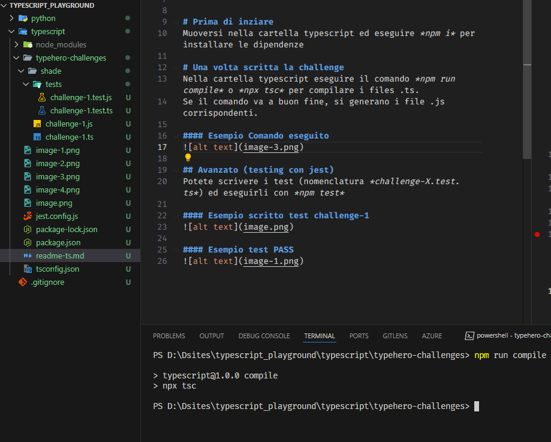
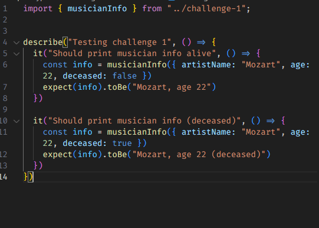
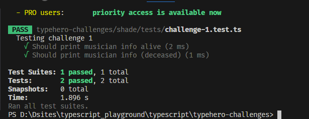

# Prima di inziare
Eseguire *npm i* per installare le dipendenze

* * *

# DOCS e articoli di supporto
[ESEMPI DI JEST](https://medium.com/nerd-for-tech/testing-typescript-with-jest-290eaee9479d)\
[JEST DOC](https://jestjs.io/es-ES/docs/getting-started)\
[MARKDOWN DOC](https://markdown.es/sintaxis-markdown/#reglas)

* * *

# Come creare le challenge
Nella cartella typehero-challenges create una sottocartella con il vostro nome e create il file utilizzando il formato *challenge-X.ts* dove X è il numero della challenge.

#### Esempio struttura

* * *

# Una volta scritta la challenge
Nella cartella typescript eseguire il comando *npm run compile* o *npx tsc* per compilare i files .ts.

__Se il comando va a buon fine, si generano i file .js corrispondenti.__

#### Esempio comando *npm run compile*

* * *

## Avanzato e NON OBLIGATORIO (testing con jest)
Potete scrivere i test (nomenclatura *challenge-X.test.ts*) ed eseguirli con *npm test*

#### Esempio scritto test challenge-1

#### Esempio test PASS
